# 1.Overview
This is the Pytorch implementation of variational auto-encoder, applying on MNIST dataset.

Currently, the following models are supported:
- :heavy_check_mark:	VAE
- :heavy_check_mark:	Conv-VAE

# 2.Usage
```python
python train.py
```
The code is self-explanatory, you can specify some customized options in `train.py`.

# 3.Result
Here are some visualization results：

## 3.1 Reconstruction results
|Model | epoch 10| epoch 20| epoch 30 | epoch 40| epoch 50|
|:---: | :---:   | :---:   | :---:   | :---:   | :---:   |
|VAE   | 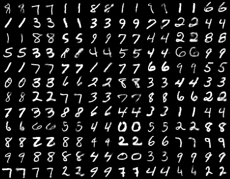 |  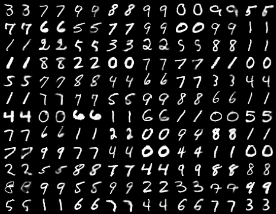 | 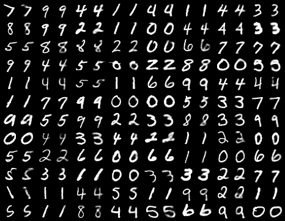 | \| \|
|Conv-VAE | 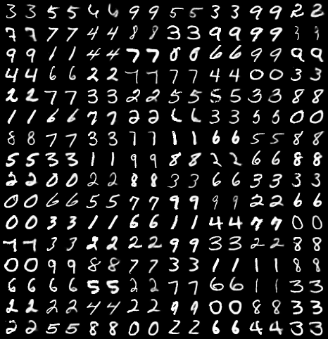  |  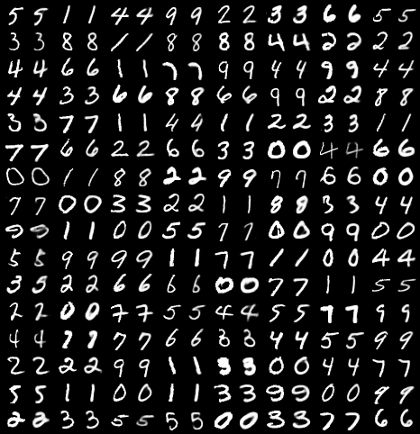 |  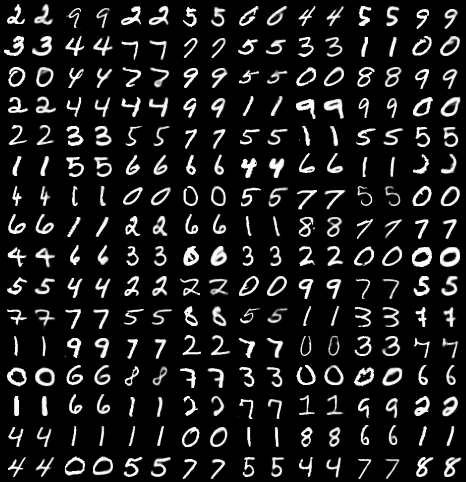  |  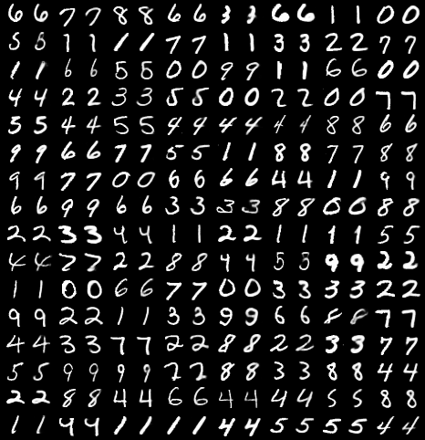 |  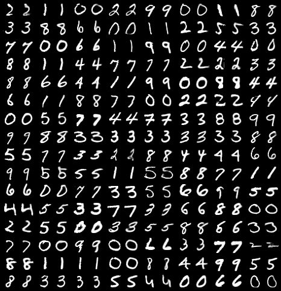 |

## 3.2 Randomly generated results

|Model | epoch 10| epoch 20| epoch 30 | epoch 40| epoch 50|
|:---: | :---:   | :---:   | :---:   | :---:   | :---:   |
|VAE  | 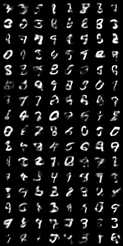 | 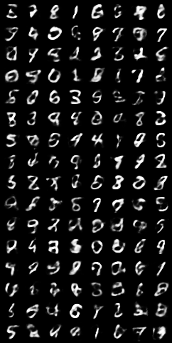 |  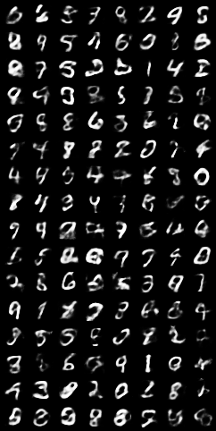| \| \|
|Conv-VAE | 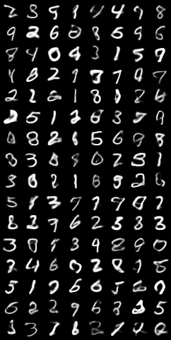  |  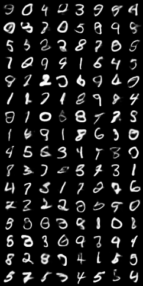 | 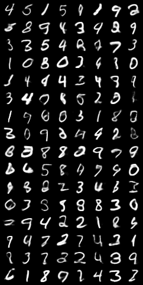 |  |  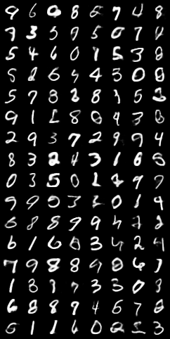 |

# 4. Pre-trained model
Donwload link:
